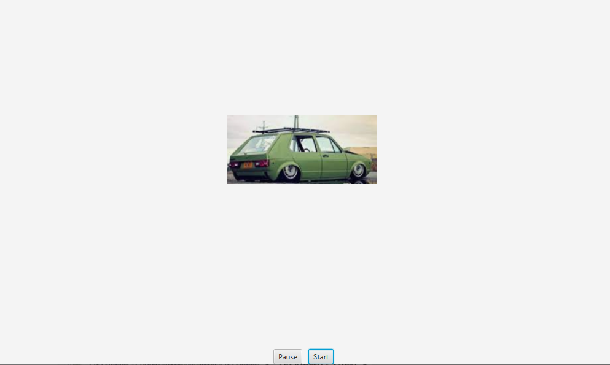

# JavaFX Car movement gui

One Paragraph of project description goes here

Using java fx create a moving image that will activate and pause via buttons as well as slow
 down and speed up using the up and down keys

## Analysis Steps

Worked through chapter 15 learning how to implement listeners, use of shorter lambda functions and path transition

### Design

Set up buttons in Hbox , image/ pathtransition in borderpane

### Testing

test for working functionality. use of debugger.

## Notes

        //needed to add (.addEventFilter(KeyEvent.KEY_PRESSED,)
        //in order to have this event trigger
        //still unaware of why this was needed or the workings behind it

        //the pt constructor requires a speed/DURATION attribute, but unable to insert rate as that attribute
        //so below later in code i had to "reset the speed/rate"
        //unaware of how i could have set rate in the constructor

## Do not change content below this line
## Adapted from a README Built With

* [Dropwizard](http://www.dropwizard.io/1.0.2/docs/) - The web framework used
* [Maven](https://maven.apache.org/) - Dependency Management
* [ROME](https://rometools.github.io/rome/) - Used to generate RSS Feeds

## Contributing

Please read [CONTRIBUTING.md](https://gist.github.com/PurpleBooth/b24679402957c63ec426) for details on our code of conduct, and the process for submitting pull requests to us.

## Versioning

We use [SemVer](http://semver.org/) for versioning. For the versions available, see the [tags on this repository](https://github.com/your/project/tags). 

## Authors

* **Billie Thompson** - *Initial work* - [PurpleBooth](https://github.com/PurpleBooth)

See also the list of [contributors](https://github.com/your/project/contributors) who participated in this project.

## License

This project is licensed under the MIT License - see the [LICENSE.md](LICENSE.md) file for details

## Acknowledgments

* Hat tip to anyone who's code was used
* Inspiration
* etc
